## KF Turbo CardGame - all available cards

### Evil Deck

| Image                                | Title                          | Description |
|--------------------------------------|--------------------------------|-------------|
| 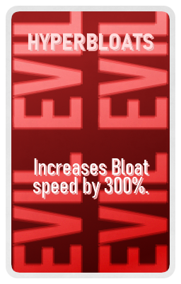 | Hyperbloats                   | Increases Bloat speed by 300%. |
| 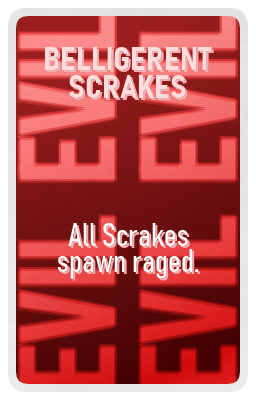 | Belligerent Scrakes           | All Scrakes spawn raged. |
| 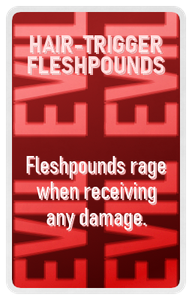 | Hair-Trigger Fleshpounds      | Fleshpounds rage when receiving any damage. |
| 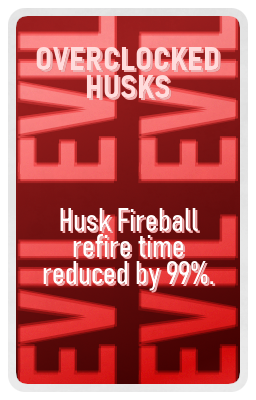 | Overclocked Husks             | Husk Fireball refire time reduced by 99%. |
| 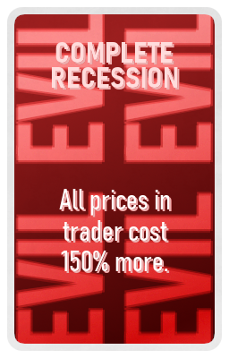 | Complete Recession            | All prices in trader cost 150% more. |
| 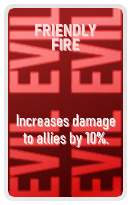 | Friendly Fire                 | Increases damage to allies by 10%. |
| 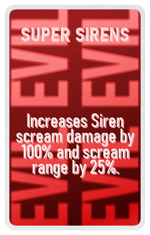 | Super Sirens                  | Increases Siren scream damage by 100% and scream range by 25%. |
| 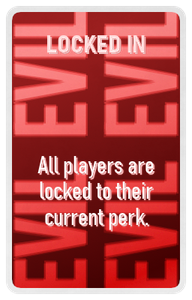 | Locked In                     | All players are locked to their current perk. |
| 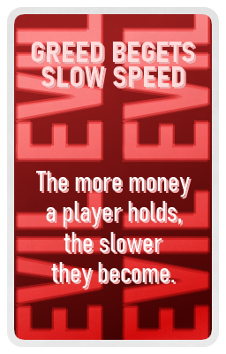 | Greed Begets Slow Speed       | The more money a player holds, the slower they become. |
|  | Slip'n'Slide                  | Players and zeds are now very slippery. |
| 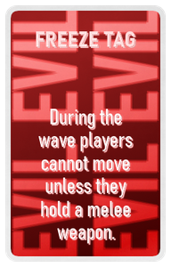 | Freeze Tag                    | During the wave players cannot move unless they hold a melee weapon. |
| 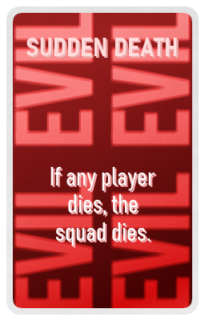 | Sudden Death                  | If any player dies, the squad dies. |
| 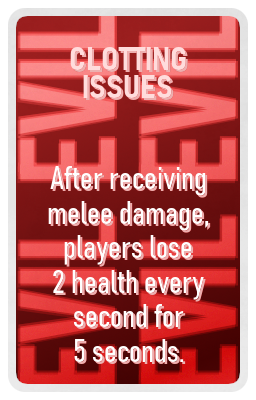 | Clotting Issues               | After receiving melee damage, players lose 2 health every second for 5 seconds. |
| 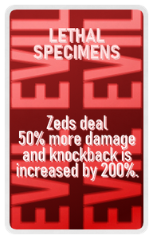 | Lethal Specimens              | Zeds deal 50% more damage and knockback is increased by 200%. |
| 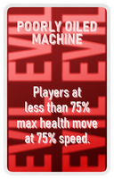 | Poorly Oiled Machine          | Players at less than 75% max health move at 75% speed. |
| 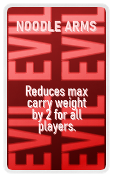 | Noodle Arms                   | Reduces max carry weight by 2 for all players. |
| 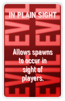 | In Plain Sight                | Allows spawns to occur in sight of players. |
| 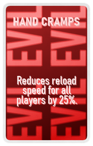 | Hand Cramps                   | Reduces reload speed for all players by 25%. |
| 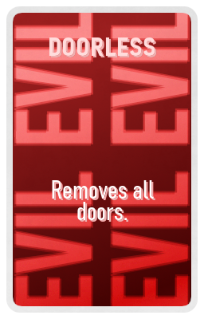 | Doorless                      | Removes all doors. |
| 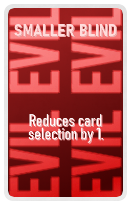 | Smaller Blind                 | Reduces card selection by 1. |
| 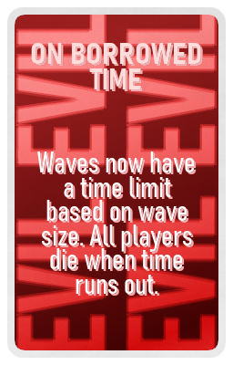 | On Borrowed Time              | Waves now have a time limit based on wave size. All players die when time runs out. |
| 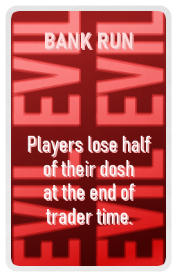 | Bank Run                      | Players lose half of their dosh at the end of trader time. |
| 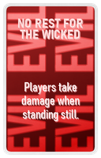 | No Rest For The Wicked        | Players take damage when standing still. |
| 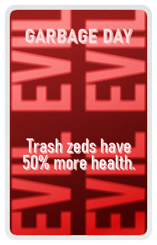 | Garbage Day                   | Trash zeds have 50% more health. |
| 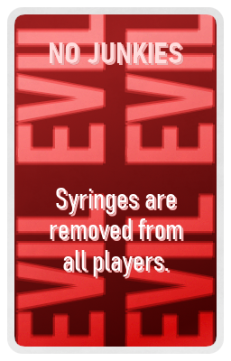 | No Junkies                    | Syringes are removed from all players. |
| 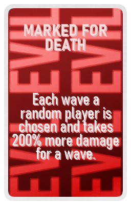 | Marked For Death              | Each wave a random player is chosen and takes 200% more damage for a wave. |
| 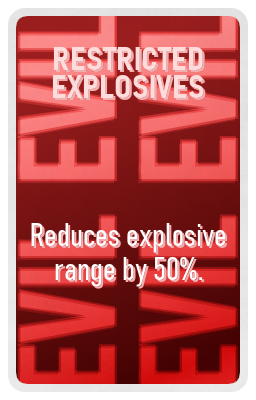 | Restricted Explosives         | Reduces explosive range by 50%. |
| 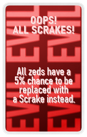 | Oops! All Scrakes!            | All zeds have a 5% chance to be replaced with a Scrake instead. |
| 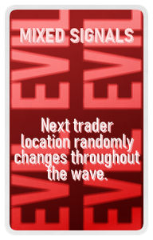 | Mixed Signals                 | Next trader location randomly changes throughout the wave. |
| 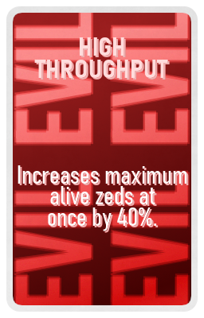 | High Throughput               | Increases maximum alive zeds at once by 40%. |
| 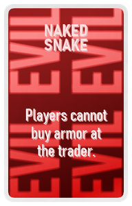 | Naked Snake                   | Players cannot buy armor at the trader. |
| 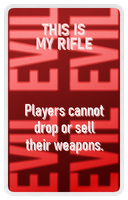 | This Is My Rifle              | Players cannot drop or sell their weapons. |
| 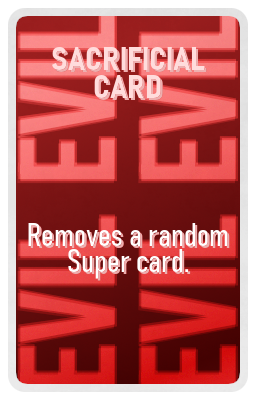 | Sacrificial Card              | Removes a random Super card. |
| 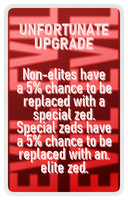 | Unfortunate Upgrade           | Non-elites have a 5% chance to be replaced with a special zed. Special zeds have a 5% chance to be replaced with an elite zed. |
| 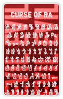 | Curse of RA                   | ??? |
| 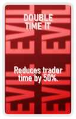 | Double Time It                | Reduces trader time by 50%. |
| 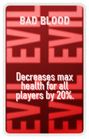 | Bad Blood                     | Decreases max health for all players by 20%. |

### Good Deck

| Image | Title | Description |
|-------|-------|-------------|
| 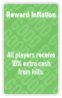 | Reward Inflation | All players receive 10% extra cash from kills. |
| 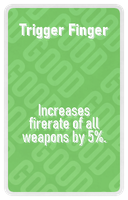 | Trigger Finger | Increases firerate of all weapons by 5%. |
| 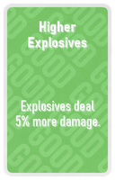 | Higher Explosives | Explosives deal 5% more damage. |
| 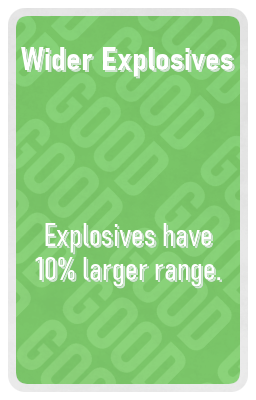 | Wider Explosives | Explosives have 10% larger range. |
| 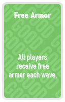 | Free Armor | All players receive free armor each wave. |
| 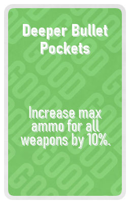 | Deeper Bullet Pockets | Increase max ammo for all weapons by 10%. |
| 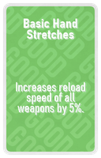 | Basic Hand Stretches | Increases reload speed of all weapons by 5%. |
| 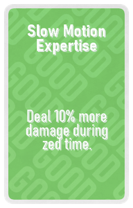 | Slow Motion Expertise | Deal 10% more damage during zed time. |
| 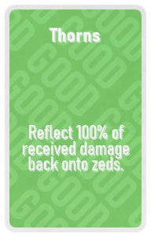 | Thorns | Reflect 100% of received damage back onto zeds. |
| 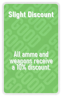 | Slight Discount | All ammo and weapons receive a 10% discount. |
| 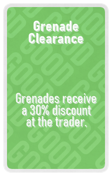 | Grenade Clearance | Grenades receive a 30% discount at the trader. |
| 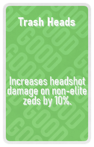 | Trash Heads | Increases headshot damage on non-elite zeds by 10%. |
| 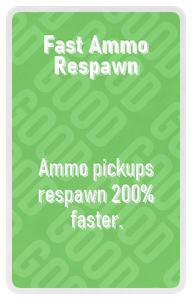 | Fast Ammo Respawn | Ammo pickups respawn 200% faster. |
| 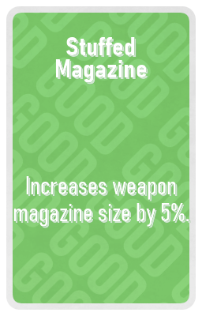 | Stuffed Magazine | Increases weapon magazine size by 5%. |
|  | Improved Focus | Decreases weapon spread and recoil by 10%. |
|  | Thicker Skin | Decreases melee damage taken from monsters by 5%. |
|  | Cardio Enjoyer | Increases player move speed by 5%. |
|  | Relaxed Pace | Decreases wave spawn rate by 5%. |
|  | Skimmed Waves | Decreases wave size by 5%. |
|  | Dauntless | When below 75% health, players deal 10% more damage. |
|  | Ranged Resistance | Decreases damage taken by ranged zed attacks by 10%. |
|  | Tier 4 Plates | Increases armor damage reduction by 10%. |
|  | My Legs Are Okay | Players no longer take fall damage. |
|  | Healthy | Increases player health by 5%. |
|  | Better Medicine | Increases heal potency by 5%. |
|  | Familiar Territory | Increases on-perk damage by 5%. |
|  | Unfamiliar Territory | Increases off-perk damage by 5%. |
|  | Extended Cut | Increases player max zed time extensions by 4. |
|  | He Who Casts The First Stone | Increases grenade max ammo by 20%. |
|  | Faster Medical Delivery | Increases medic gun and syringe recharge rate by 5%. |
|  | Walk It Off | Increases health regen by 1 every 5 seconds. |
|  | Advanced Welding | Increases weld speed by 50%. |
|  | Large Quantity Low Quality | Increases good card selection by 1. |
|  | Broader Gamble | Increases pro/con card selection by 1. |
|  | Slayer Of El Diablo | Increases damage dealt to the Patriarch by 5%. |

### ProCon Deck

| Image | Title | Description |
|-------|-------|-------------|
|  | Short Term Reward | All players receive 500 extra dosh each wave but trader time is reduced by 15%. |
|  | Sawed Off Magazines | Increases reload speed of all weapons by 15% and reduces magazine size by 20%. |
|  | Mo' Cards Mo' Problems | Increases card selection by 1 but increases wave size by 25%. |
|  | Fleshpound++ Scrake-- | Fleshpounds take 15% less damage but Scrakes take 10% more damage. |
|  | Brisk Pace | Reduces wave size by 10% but increases wave speed by 200%. |
|  | Specialization | Increases on-perk weapon damage by 5% but reduces off-perk damage by 15%. |
|  | Precision Explosives | Increases explosive damage by 10% but reduces explosive range by 25%. |
|  | Awkwardly Deep Ammo Pockets | Increases max ammo by 10% but reduces reload speed by 15%. |
|  | Conflict Escalation | Increases damage by players by 5% and damage by zeds by 10%. |
|  | Compound Surplus | Increases dosh received from kills by 15% and wave size by 10%. |
|  | Double Edged Sword | Increases player damage by 5% and friendly fire damage by 5%. |
|  | Heavy Ammunition | Increases player ranged damage by 5% but reduces max ammo by 10%. |
|  | Magazine Overclock | Increases firerate by 15% but reduces reload speed by 10%. |
|  | Precision Shooting | Reduces spread by 30% but reduces firerate by 10%. |
|  | Thin Skinned | Increases player speed by 10% but increases damage taken from zeds by 10%. |
|  | Premium Weapons | Increases weapon firerate, reload, and accuracy by 5% but increases trader prices by 15%. |
|  | Turtle Shell | Reduces damage to players by 10% and player move speed by 5%. |
|  | Price Paid In Blood | Reduces player health by 10% and trader prices by 50%. |
|  | Distracted Driving | Stalkers are more distracting and deal 100% more damage. |
|  | High Speed Low Drag | Decreases max carry capacity by 1. Increases player movement speed by 15%. |
|  | Unlicensed Practitioner | Increases heal potency for Field Medics by 10% but reduces heal potency for non-Field Medics by 25%. |
|  | Russian Roulette | Zeds and players have a 0.1% chance to die instantly when taking damage. |
|  | Concentrated Healing | Increases heal potency by 15% but reduces heal charge rate by 15%. |
|  | Dropping Ballast | Increases max ammo by 10% but reduces grenade max ammo by 20%. |
|  | With A Bit More Kick | Increases shotgun pellet count by 20% but increases shotgun recoil and kickback by 25%. |
|  | More Game To Play | Increases max weapon ammo by 15% and damage by 5% but wave size is increased by 20%. |
|  | Collateral Damage | Increases explosive damage by 10% but increases friendly fire damage by 5%. |
|  | More Healing More Hurting | Increases heal potency by 20% but increases friendly fire damage by 5%. |
|  | Oversized Pipebombs | Increases Pipebomb damage by 50% and radius by 25% but reduces Pipebomb max ammo by 50%. |
|  | Short Hop | Increases player speed by 10% but reduces jump height by 75%. |
|  | Charge Exchange | Increases heal recharge speed by 25% but reduces weld speed by 50%. |
|  | Risky Regen | Increases regen by 3 every 5 seconds but reduces max health by 10%. |
|  | Diluted Healing | Reduces heal potency by 15% but increases heal charge rate by 15%. |
|------------------|---------------------------|-------------------------------------------------------------------------------------|
|  | Trade In | Removes all good cards in exchange for a random super card. |
|  | A Deal With The Devil | In exchange for receiving a random Super card, receive a random Evil card as well. |
|  | Re-Roll | All cards are rerolled and all card decks are reset. |
|  | Draw One | Receive a random card from any deck. |
|  | A Soul For A Soul | Removes a random super card and removes a random evil card. |

### Super Deck

| Image | Title | Description |
|-------|-------|-------------|
|  | Fist of the North London | Increases Berserker on-perk melee weapon firerate by 200%. |
|  | Commando Firing Extension | Increases Commando on-perk weapon magazine size by 200%, reload speed by 20% and max ammo by 20%. |
|  | Fire Hazard | Increases Firebug on-perk weapon fire damage by 50% and firerate by 100%. |
|  | Uber Medic | Increases Field Medic grenade damage by 900%, on-perk weapon magazine size by 100%, and heal potency by 50%. |
|  | Weakened Fleshpounds | Increases damage dealt to Fleshpounds by 50%. |
|  | Anti-Chainsaw Coalition | Increases damage dealt to Scrakes by 50%. |
|  | Super Grenades | Increases grenade carry capacity by 100% and increases power of all grenades by 100%. |
|  | Overheal | Increase max health for all players by 100%. |
|  | Adrenaline | Increases player movement speed for all players by 30%. |
|  | Strategic Reload | Increases all weapon reload speed by 50%. |
|  | Earplugs | Completely nullify scream damage. |
|  | Cheating Death | All players can cheat death once. |
|  | Unshakeable | Explosive damage nullified for all players. |
|  | Big Head Mode | Increases the size of zeds' heads by 100%. |
|  | Hypersonic Ammunition | All weapon bullet penetration is doubled. |
|  | Strong Arm | Increases max carry weight by 3 for all players. |
|  | Diazepam | Reduces spread and recoil for all players by 80%. |
|  | Maximum Payne | Increases dual pistol's magazine size by 50% and firerate/reload speed during zed time by 100%. |
|  | Packed Shells | Increases shotgun pellet count by 50%. |
|  | Substitute | Negates the first 10 times a player receives damage each wave. |
|  | The Deepest of Ammo Pockets | Increases max ammo by 35%. |
|  | Fastest Hands In The West | Increases weapon swap speed by 66%. |
|  | Mass Detonation | Explosive kills have a 25% chance to trigger explosions that deal 25% of the killed zed's max health. |
|  | Everything Must Go | All ammo and weapons receive a 75% discount. |
|  | Suppressive Fire | Increases firerate of all weapons by 66%. |
|  | Cleanse | Removes a random Evil card. |
|  | Larger Blind | Increases card selection by 1. |
|  | Critical Hit | Players' 10th shots and swings deal 150% more damage. |
|  | Too Much For zBlock | Increases player air control significantly. |
|  | De-Evolution | All zeds have a chance to be replaced with weaker versions of themselves. |
|  | Break Time | Increases trader time by 100%. |
|  | Pest Control | Trash zeds take 66% more damage. |
