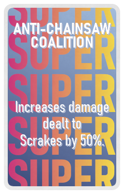
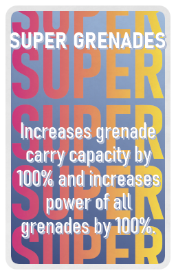
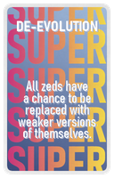

## KF Turbo CardGame - all available cards

### Evil Deck

<table border="1">
  <thead>
    <tr>
      <th style="width: 150px;">Image</th>
      <th style="width: 150px;">Title</th>
      <th style="width: 200px;">Description</th>
    </tr>
  </thead>
  <tbody>
    <tr style="height: 200px;">
      <td style="width: 150px;"></td>
      <td style="width: 150px;">Hyperbloats</td>
      <td style="width: 200px;">Increases Bloat speed by 300%.</td>
    </tr>
    <tr style="height: 200px;">
      <td style="width: 150px;"></td>
      <td style="width: 150px;">Belligerent Scrakes</td>
      <td style="width: 200px;">All Scrakes spawn raged.</td>
    </tr>
    <tr style="height: 200px;">
      <td style="width: 150px;"></td>
      <td style="width: 150px;">Hair-Trigger Fleshpounds</td>
      <td style="width: 200px;">Fleshpounds rage when receiving any damage.</td>
    </tr>
    <tr style="height: 200px;">
      <td style="width: 150px;"></td>
      <td style="width: 150px;">Overclocked Husks</td>
      <td style="width: 200px;">Husk Fireball refire time reduced by 99%.</td>
    </tr>
    <tr style="height: 200px;">
      <td style="width: 150px;"></td>
      <td style="width: 150px;">Complete Recession</td>
      <td style="width: 200px;">All prices in trader cost 150% more.</td>
    </tr>
    <tr style="height: 200px;">
      <td style="width: 150px;"></td>
      <td style="width: 150px;">Friendly Fire</td>
      <td style="width: 200px;">Increases damage to allies by 10%.</td>
    </tr>
    <tr style="height: 200px;">
      <td style="width: 150px;"></td>
      <td style="width: 150px;">Super Sirens</td>
      <td style="width: 200px;">Increases Siren scream damage by 100% and scream range by 25%.</td>
    </tr>
    <tr style="height: 200px;">
      <td style="width: 150px;"></td>
      <td style="width: 150px;">Locked In</td>
      <td style="width: 200px;">All players are locked to their current perk.</td>
    </tr>
    <tr style="height: 200px;">
      <td style="width: 150px;"></td>
      <td style="width: 150px;">Greed Begets Slow Speed</td>
      <td style="width: 200px;">The more money a player holds, the slower they become.</td>
    </tr>
    <tr style="height: 200px;">
      <td style="width: 150px;"></td>
      <td style="width: 150px;">Slip'n'Slide</td>
      <td style="width: 200px;">Players and zeds are now very slippery.</td>
    </tr>
    <tr style="height: 200px;">
      <td style="width: 150px;"></td>
      <td style="width: 150px;">Freeze Tag</td>
      <td style="width: 200px;">During the wave players cannot move unless they hold a melee weapon.</td>
    </tr>
    <tr style="height: 200px;">
      <td style="width: 150px;"></td>
      <td style="width: 150px;">Sudden Death</td>
      <td style="width: 200px;">If any player dies, the squad dies.</td>
    </tr>
    <tr style="height: 200px;">
      <td style="width: 150px;"></td>
      <td style="width: 150px;">Clotting Issues</td>
      <td style="width: 200px;">After receiving melee damage, players lose 2 health every second for 5 seconds.</td>
    </tr>
    <tr style="height: 200px;">
      <td style="width: 150px;"></td>
      <td style="width: 150px;">Lethal Specimens</td>
      <td style="width: 200px;">Zeds deal 50% more damage and knockback is increased by 200%.</td>
    </tr>
    <tr style="height: 200px;">
      <td style="width: 150px;"></td>
      <td style="width: 150px;">Poorly Oiled Machine</td>
      <td style="width: 200px;">Players at less than 75% max health move at 75% speed.</td>
    </tr>
    <tr style="height: 200px;">
      <td style="width: 150px;"></td>
      <td style="width: 150px;">Noodle Arms</td>
      <td style="width: 200px;">Reduces max carry weight by 2 for all players.</td>
    </tr>
    <tr style="height: 200px;">
      <td style="width: 150px;"></td>
      <td style="width: 150px;">In Plain Sight</td>
      <td style="width: 200px;">Allows spawns to occur in sight of players.</td>
    </tr>
    <tr style="height: 200px;">
      <td style="width: 150px;"></td>
      <td style="width: 150px;">Hand Cramps</td>
      <td style="width: 200px;">Reduces reload speed for all players by 25%.</td>
    </tr>
    <tr style="height: 200px;">
      <td style="width: 150px;"></td>
      <td style="width: 150px;">Doorless</td>
      <td style="width: 200px;">Removes all doors.</td>
    </tr>
    <tr style="height: 200px;">
      <td style="width: 150px;"></td>
      <td style="width: 150px;">Smaller Blind</td>
      <td style="width: 200px;">Reduces card selection by 1.</td>
    </tr>
    <tr style="height: 200px;">
      <td style="width: 150px;"></td>
      <td style="width: 150px;">On Borrowed Time</td>
      <td style="width: 200px;">Waves now have a time limit based on wave size. All players die when time runs out.</td>
    </tr>
    <tr style="height: 200px;">
      <td style="width: 150px;"></td>
      <td style="width: 150px;">Bank Run</td>
      <td style="width: 200px;">Players lose half of their dosh at the end of trader time.</td>
    </tr>
    <tr style="height: 200px;">
      <td style="width: 150px;"></td>
      <td style="width: 150px;">No Rest For The Wicked</td>
      <td style="width: 200px;">Players take damage when standing still.</td>
    </tr>
    <tr style="height: 200px;">
      <td style="width: 150px;"></td>
      <td style="width: 150px;">Garbage Day</td>
      <td style="width: 200px;">Trash zeds have 50% more health.</td>
    </tr>
    <tr style="height: 200px;">
      <td style="width: 150px;"></td>
      <td style="width: 150px;">No Junkies</td>
      <td style="width: 200px;">Syringes are removed from all players.</td>
    </tr>
    <tr style="height: 200px;">
      <td style="width: 150px;"></td>
      <td style="width: 150px;">Marked For Death</td>
      <td style="width: 200px;">Each wave a random player is chosen and takes 200% more damage for a wave.</td>
    </tr>
    <tr style="height: 200px;">
      <td style="width: 150px;"></td>
      <td style="width: 150px;">Restricted Explosives</td>
      <td style="width: 200px;">Reduces explosive range by 50%.</td>
    </tr>
    <tr style="height: 200px;">
      <td style="width: 150px;"></td>
      <td style="width: 150px;">Oops! All Scrakes!</td>
      <td style="width: 200px;">All zeds have a 5% chance to be replaced with a Scrake instead.</td>
    </tr>
    <tr style="height: 200px;">
      <td style="width: 150px;"></td>
      <td style="width: 150px;">Mixed Signals</td>
      <td style="width: 200px;">Next trader location randomly changes throughout the wave.</td>
    </tr>
    <tr style="height: 200px;">
      <td style="width: 150px;"></td>
      <td style="width: 150px;">High Throughput</td>
      <td style="width: 200px;">Increases maximum alive zeds at once by 40%.</td>
    </tr>
    <tr style="height: 200px;">
      <td style="width: 150px;"></td>
      <td style="width: 150px;">Naked Snake</td>
      <td style="width: 200px;">Players cannot buy armor at the trader.</td>
    </tr>
    <tr style="height: 200px;">
      <td style="width: 150px;"></td>
      <td style="width: 150px;">This Is My Rifle</td>
      <td style="width: 200px;">Players cannot drop or sell their weapons.</td>
    </tr>
    <tr style="height: 200px;">
      <td style="width: 150px;"></td>
      <td style="width: 150px;">Sacrificial Card</td>
      <td style="width: 200px;">Removes a random Super card.</td>
    </tr>
    <tr style="height: 200px;">
      <td style="width: 150px;"></td>
      <td style="width: 150px;">Unfortunate Upgrade</td>
      <td style="width: 200px;">Non-elites have a 5% chance to be replaced with a special zed. Special zeds have a 5% chance to be replaced with an elite zed.</td>
    </tr>
    <tr style="height: 200px;">
      <td style="width: 150px;"></td>
      <td style="width: 150px;">Curse of RA</td>
      <td style="width: 200px;">???</td>
    </tr>
    <tr style="height: 200px;">
      <td style="width: 150px;"></td>
      <td style="width: 150px;">Double Time It</td>
      <td style="width: 200px;">Reduces trader time by 50%.</td>
    </tr>
    <tr style="height: 200px;">
      <td style="width: 150px;"></td>
      <td style="width: 150px;">Bad Blood</td>
      <td style="width: 200px;">Decreases max health for all players by 20%.</td>
    </tr>
  </tbody>
</table>

### Good Deck

<table border="1">
  <thead>
    <tr>
      <th style="width: 150px;">Image</th>
      <th style="width: 150px;">Title</th>
      <th style="width: 200px;">Description</th>
    </tr>
  </thead>
  <tbody>
    <tr style="height: 200px;">
      <td style="width: 150px;"></td>
      <td style="width: 150px;">Reward Inflation</td>
      <td style="width: 200px;">All players receive 10% extra cash from kills.</td>
    </tr>
    <tr style="height: 200px;">
      <td style="width: 150px;"></td>
      <td style="width: 150px;">Trigger Finger</td>
      <td style="width: 200px;">Increases firerate of all weapons by 5%.</td>
    </tr>
    <tr style="height: 200px;">
      <td style="width: 150px;"></td>
      <td style="width: 150px;">Higher Explosives</td>
      <td style="width: 200px;">Explosives deal 5% more damage.</td>
    </tr>
    <tr style="height: 200px;">
      <td style="width: 150px;"></td>
      <td style="width: 150px;">Wider Explosives</td>
      <td style="width: 200px;">Explosives have 10% larger range.</td>
    </tr>
    <tr style="height: 200px;">
      <td style="width: 150px;"></td>
      <td style="width: 150px;">Free Armor</td>
      <td style="width: 200px;">All players receive free armor each wave.</td>
    </tr>
    <tr style="height: 200px;">
      <td style="width: 150px;"></td>
      <td style="width: 150px;">Deeper Bullet Pockets</td>
      <td style="width: 200px;">Increase max ammo for all weapons by 10%.</td>
    </tr>
    <tr style="height: 200px;">
      <td style="width: 150px;"></td>
      <td style="width: 150px;">Basic Hand Stretches</td>
      <td style="width: 200px;">Increases reload speed of all weapons by 5%.</td>
    </tr>
    <tr style="height: 200px;">
      <td style="width: 150px;"></td>
      <td style="width: 150px;">Slow Motion Expertise</td>
      <td style="width: 200px;">Deal 10% more damage during zed time.</td>
    </tr>
    <tr style="height: 200px;">
      <td style="width: 150px;"></td>
      <td style="width: 150px;">Thorns</td>
      <td style="width: 200px;">Reflect 100% of received damage back onto zeds.</td>
    </tr>
    <tr style="height: 200px;">
      <td style="width: 150px;"></td>
      <td style="width: 150px;">Slight Discount</td>
      <td style="width: 200px;">All ammo and weapons receive a 10% discount.</td>
    </tr>
    <tr style="height: 200px;">
      <td style="width: 150px;"></td>
      <td style="width: 150px;">Grenade Clearance</td>
      <td style="width: 200px;">Grenades receive a 30% discount at the trader.</td>
    </tr>
    <tr style="height: 200px;">
      <td style="width: 150px;"></td>
      <td style="width: 150px;">Trash Heads</td>
      <td style="width: 200px;">Increases headshot damage on non-elite zeds by 10%.</td>
    </tr>
    <tr style="height: 200px;">
      <td style="width: 150px;"></td>
      <td style="width: 150px;">Fast Ammo Respawn</td>
      <td style="width: 200px;">Ammo pickups respawn 200% faster.</td>
    </tr>
    <tr style="height: 200px;">
      <td style="width: 150px;"></td>
      <td style="width: 150px;">Stuffed Magazine</td>
      <td style="width: 200px;">Increases weapon magazine size by 5%.</td>
    </tr>
    <tr style="height: 200px;">
      <td style="width: 150px;"></td>
      <td style="width: 150px;">Improved Focus</td>
      <td style="width: 200px;">Decreases weapon spread and recoil by 10%.</td>
    </tr>
    <tr style="height: 200px;">
      <td style="width: 150px;"></td>
      <td style="width: 150px;">Thicker Skin</td>
      <td style="width: 200px;">Decreases melee damage taken from monsters by 5%.</td>
    </tr>
    <tr style="height: 200px;">
      <td style="width: 150px;"></td>
      <td style="width: 150px;">Cardio Enjoyer</td>
      <td style="width: 200px;">Increases player move speed by 5%.</td>
    </tr>
    <tr style="height: 200px;">
      <td style="width: 150px;"></td>
      <td style="width: 150px;">Relaxed Pace</td>
      <td style="width: 200px;">Decreases wave spawn rate by 5%.</td>
    </tr>
    <tr style="height: 200px;">
      <td style="width: 150px;"></td>
      <td style="width: 150px;">Skimmed Waves</td>
      <td style="width: 200px;">Decreases wave size by 5%.</td>
    </tr>
    <tr style="height: 200px;">
      <td style="width: 150px;"></td>
      <td style="width: 150px;">Dauntless</td>
      <td style="width: 200px;">When below 75% health, players deal 10% more damage.</td>
    </tr>
    <tr style="height: 200px;">
      <td style="width: 150px;"></td>
      <td style="width: 150px;">Ranged Resistance</td>
      <td style="width: 200px;">Decreases damage taken by ranged zed attacks by 10%.</td>
    </tr>
    <tr style="height: 200px;">
      <td style="width: 150px;"></td>
      <td style="width: 150px;">Tier 4 Plates</td>
      <td style="width: 200px;">Increases armor damage reduction by 10%.</td>
    </tr>
    <tr style="height: 200px;">
      <td style="width: 150px;"></td>
      <td style="width: 150px;">My Legs Are Okay</td>
      <td style="width: 200px;">Players no longer take fall damage.</td>
    </tr>
    <tr style="height: 200px;">
      <td style="width: 150px;"></td>
      <td style="width: 150px;">Healthy</td>
      <td style="width: 200px;">Increases player health by 5%.</td>
    </tr>
    <tr style="height: 200px;">
      <td style="width: 150px;"></td>
      <td style="width: 150px;">Better Medicine</td>
      <td style="width: 200px;">Increases heal potency by 5%.</td>
    </tr>
    <tr style="height: 200px;">
      <td style="width: 150px;"></td>
      <td style="width: 150px;">Familiar Territory</td>
      <td style="width: 200px;">Increases on-perk damage by 5%.</td>
    </tr>
    <tr style="height: 200px;">
      <td style="width: 150px;"></td>
      <td style="width: 150px;">Unfamiliar Territory</td>
      <td style="width: 200px;">Increases off-perk damage by 5%.</td>
    </tr>
    <tr style="height: 200px;">
      <td style="width: 150px;"></td>
      <td style="width: 150px;">Extended Cut</td>
      <td style="width: 200px;">Increases player max zed time extensions by 4.</td>
    </tr>
    <tr style="height: 200px;">
      <td style="width: 150px;"></td>
      <td style="width: 150px;">He Who Casts The First Stone</td>
      <td style="width: 200px;">Increases grenade max ammo by 20%.</td>
    </tr>
    <tr style="height: 200px;">
      <td style="width: 150px;"></td>
      <td style="width: 150px;">Faster Medical Delivery</td>
      <td style="width: 200px;">Increases medic gun and syringe recharge rate by 5%.</td>
    </tr>
    <tr style="height: 200px;">
      <td style="width: 150px;"></td>
      <td style="width: 150px;">Walk It Off</td>
      <td style="width: 200px;">Increases health regen by 1 every 5 seconds.</td>
    </tr>
    <tr style="height: 200px;">
      <td style="width: 150px;"></td>
      <td style="width: 150px;">Advanced Welding</td>
      <td style="width: 200px;">Increases weld speed by 50%.</td>
    </tr>
    <tr style="height: 200px;">
      <td style="width: 150px;"></td>
      <td style="width: 150px;">Large Quantity Low Quality</td>
      <td style="width: 200px;">Increases good card selection by 1.</td>
    </tr>
    <tr style="height: 200px;">
      <td style="width: 150px;"></td>
      <td style="width: 150px;">Broader Gamble</td>
      <td style="width: 200px;">Increases pro/con card selection by 1.</td>
    </tr>
    <tr style="height: 200px;">
      <td style="width: 150px;"></td>
      <td style="width: 150px;">Slayer Of El Diablo</td>
      <td style="width: 200px;">Increases damage dealt to the Patriarch by 5%.</td>
    </tr>
  </tbody>
</table>

### ProCon Deck

<table border="1">
  <thead>
    <tr>
      <th style="width: 150px;">Image</th>
      <th style="width: 150px;">Title</th>
      <th style="width: 200px;">Description</th>
    </tr>
  </thead>
  <tbody>
    <tr style="height: 200px;">
      <td style="width: 150px;"></td>
      <td style="width: 150px;">Short Term Reward</td>
      <td style="width: 200px;">All players receive 500 extra dosh each wave but trader time is reduced by 15%.</td>
    </tr>
    <tr style="height: 200px;">
      <td style="width: 150px;"></td>
      <td style="width: 150px;">Sawed Off Magazines</td>
      <td style="width: 200px;">Increases reload speed of all weapons by 15% and reduces magazine size by 20%.</td>
    </tr>
    <tr style="height: 200px;">
      <td style="width: 150px;"></td>
      <td style="width: 150px;">Mo' Cards Mo' Problems</td>
      <td style="width: 200px;">Increases card selection by 1 but increases wave size by 25%.</td>
    </tr>
    <tr style="height: 200px;">
      <td style="width: 150px;"></td>
      <td style="width: 150px;">Fleshpound++ Scrake--</td>
      <td style="width: 200px;">Fleshpounds take 15% less damage but Scrakes take 10% more damage.</td>
    </tr>
    <tr style="height: 200px;">
      <td style="width: 150px;"></td>
      <td style="width: 150px;">Brisk Pace</td>
      <td style="width: 200px;">Reduces wave size by 10% but increases wave speed by 200%.</td>
    </tr>
    <tr style="height: 200px;">
      <td style="width: 150px;"></td>
      <td style="width: 150px;">Specialization</td>
      <td style="width: 200px;">Increases on-perk weapon damage by 5% but reduces off-perk damage by 15%.</td>
    </tr>
    <tr style="height: 200px;">
      <td style="width: 150px;"></td>
      <td style="width: 150px;">Precision Explosives</td>
      <td style="width: 200px;">Increases explosive damage by 10% but reduces explosive range by 25%.</td>
    </tr>
    <tr style="height: 200px;">
      <td style="width: 150px;"></td>
      <td style="width: 150px;">Awkwardly Deep Ammo Pockets</td>
      <td style="width: 200px;">Increases max ammo by 10% but reduces reload speed by 15%.</td>
    </tr>
    <tr style="height: 200px;">
      <td style="width: 150px;"></td>
      <td style="width: 150px;">Conflict Escalation</td>
      <td style="width: 200px;">Increases damage by players by 5% and damage by zeds by 10%.</td>
    </tr>
    <tr style="height: 200px;">
      <td style="width: 150px;"></td>
      <td style="width: 150px;">Compound Surplus</td>
      <td style="width: 200px;">Increases dosh received from kills by 15% and wave size by 10%.</td>
    </tr>
    <tr style="height: 200px;">
      <td style="width: 150px;"></td>
      <td style="width: 150px;">Double Edged Sword</td>
      <td style="width: 200px;">Increases player damage by 5% and friendly fire damage by 5%.</td>
    </tr>
    <tr style="height: 200px;">
      <td style="width: 150px;"></td>
      <td style="width: 150px;">Heavy Ammunition</td>
      <td style="width: 200px;">Increases player ranged damage by 5% but reduces max ammo by 10%.</td>
    </tr>
    <tr style="height: 200px;">
      <td style="width: 150px;"></td>
      <td style="width: 150px;">Magazine Overclock</td>
      <td style="width: 200px;">Increases firerate by 15% but reduces reload speed by 10%.</td>
    </tr>
    <tr style="height: 200px;">
      <td style="width: 150px;"></td>
      <td style="width: 150px;">Precision Shooting</td>
      <td style="width: 200px;">Reduces spread by 30% but reduces firerate by 10%.</td>
    </tr>
    <tr style="height: 200px;">
      <td style="width: 150px;"></td>
      <td style="width: 150px;">Thin Skinned</td>
      <td style="width: 200px;">Increases player speed by 10% but increases damage taken from zeds by 10%.</td>
    </tr>
    <tr style="height: 200px;">
      <td style="width: 150px;"></td>
      <td style="width: 150px;">Premium Weapons</td>
      <td style="width: 200px;">Increases weapon firerate, reload, and accuracy by 5% but increases trader prices by 15%.</td>
    </tr>
    <tr style="height: 200px;">
      <td style="width: 150px;"></td>
      <td style="width: 150px;">Turtle Shell</td>
      <td style="width: 200px;">Reduces damage to players by 10% and player move speed by 5%.</td>
    </tr>
    <tr style="height: 200px;">
      <td style="width: 150px;"></td>
      <td style="width: 150px;">Price Paid In Blood</td>
      <td style="width: 200px;">Reduces player health by 10% and trader prices by 50%.</td>
    </tr>
    <tr style="height: 200px;">
      <td style="width: 150px;"></td>
      <td style="width: 150px;">Distracted Driving</td>
      <td style="width: 200px;">Stalkers are more distracting and deal 100% more damage.</td>
    </tr>
    <tr style="height: 200px;">
      <td style="width: 150px;"></td>
      <td style="width: 150px;">High Speed Low Drag</td>
      <td style="width: 200px;">Decreases max carry capacity by 1. Increases player movement speed by 15%.</td>
    </tr>
    <tr style="height: 200px;">
      <td style="width: 150px;"></td>
      <td style="width: 150px;">Unlicensed Practitioner</td>
      <td style="width: 200px;">Increases heal potency for Field Medics by 10% but reduces heal potency for non-Field Medics by 25%.</td>
    </tr>
    <tr style="height: 200px;">
      <td style="width: 150px;"></td>
      <td style="width: 150px;">Russian Roulette</td>
      <td style="width: 200px;">Zeds and players have a 0.1% chance to die instantly when taking damage.</td>
    </tr>
    <tr style="height: 200px;">
      <td style="width: 150px;"></td>
      <td style="width: 150px;">Concentrated Healing</td>
      <td style="width: 200px;">Increases heal potency by 15% but reduces heal charge rate by 15%.</td>
    </tr>
    <tr style="height: 200px;">
      <td style="width: 150px;"></td>
      <td style="width: 150px;">Dropping Ballast</td>
      <td style="width: 200px;">Increases max ammo by 10% but reduces grenade max ammo by 20%.</td>
    </tr>
    <tr style="height: 200px;">
      <td style="width: 150px;"></td>
      <td style="width: 150px;">With A Bit More Kick</td>
      <td style="width: 200px;">Increases shotgun pellet count by 20% but increases shotgun recoil and kickback by 25%.</td>
    </tr>
    <tr style="height: 200px;">
      <td style="width: 150px;"></td>
      <td style="width: 150px;">More Game To Play</td>
      <td style="width: 200px;">Increases max weapon ammo by 15% and damage by 5% but wave size is increased by 20%.</td>
    </tr>
    <tr style="height: 200px;">
      <td style="width: 150px;"></td>
      <td style="width: 150px;">Collateral Damage</td>
      <td style="width: 200px;">Increases explosive damage by 10% but increases friendly fire damage by 5%.</td>
    </tr>
    <tr style="height: 200px;">
      <td style="width: 150px;"></td>
      <td style="width: 150px;">More Healing More Hurting</td>
      <td style="width: 200px;">Increases heal potency by 20% but increases friendly fire damage by 5%.</td>
    </tr>
    <tr style="height: 200px;">
      <td style="width: 150px;"></td>
      <td style="width: 150px;">Oversized Pipebombs</td>
      <td style="width: 200px;">Increases Pipebomb damage by 50% and radius by 25% but reduces Pipebomb max ammo by 50%.</td>
    </tr>
    <tr style="height: 200px;">
      <td style="width: 150px;"></td>
      <td style="width: 150px;">Short Hop</td>
      <td style="width: 200px;">Increases player speed by 10% but reduces jump height by 75%.</td>
    </tr>
    <tr style="height: 200px;">
      <td style="width: 150px;"></td>
      <td style="width: 150px;">Charge Exchange</td>
      <td style="width: 200px;">Increases heal recharge speed by 25% but reduces weld speed by 50%.</td>
    </tr>
    <tr style="height: 200px;">
      <td style="width: 150px;"></td>
      <td style="width: 150px;">Risky Regen</td>
      <td style="width: 200px;">Increases regen by 3 every 5 seconds but reduces max health by 10%.</td>
    </tr>
    <tr style="height: 200px;">
      <td style="width: 150px;"></td>
      <td style="width: 150px;">Diluted Healing</td>
      <td style="width: 200px;">Reduces heal potency by 15% but increases heal charge rate by 15%.</td>
    </tr>
    <tr style="height: 200px;">
      <td style="width: 150px;"></td>
      <td style="width: 150px;">Trade In</td>
      <td style="width: 200px;">Removes all good cards in exchange for a random super card.</td>
    </tr>
    <tr style="height: 200px;">
      <td style="width: 150px;"></td>
      <td style="width: 150px;">A Deal With The Devil</td>
      <td style="width: 200px;">In exchange for receiving a random Super card, receive a random Evil card as well.</td>
    </tr>
    <tr style="height: 200px;">
      <td style="width: 150px;"></td>
      <td style="width: 150px;">Re-Roll</td>
      <td style="width: 200px;">All cards are rerolled and all card decks are reset.</td>
    </tr>
    <tr style="height: 200px;">
      <td style="width: 150px;"></td>
      <td style="width: 150px;">Draw One</td>
      <td style="width: 200px;">Receive a random card from any deck.</td>
    </tr>
    <tr style="height: 200px;">
      <td style="width: 150px;"></td>
      <td style="width: 150px;">A Soul For A Soul</td>
      <td style="width: 200px;">Removes a random super card and removes a random evil card.</td>
    </tr>
  </tbody>
</table>

### Super Deck

<table border="1">
  <thead>
    <tr>
      <th style="width: 150px;">Image</th>
      <th style="width: 150px;">Title</th>
      <th style="width: 200px;">Description</th>
    </tr>
  </thead>
  <tbody>
    <tr style="height: 200px;">
      <td style="width: 150px;"></td>
      <td style="width: 150px;">Fist of the North London</td>
      <td style="width: 200px;">Increases Berserker on-perk melee weapon firerate by 200%.</td>
    </tr>
    <tr style="height: 200px;">
      <td style="width: 150px;"></td>
      <td style="width: 150px;">Commando Firing Extension</td>
      <td style="width: 200px;">Increases Commando on-perk weapon magazine size by 200%, reload speed by 20% and max ammo by 20%.</td>
    </tr>
    <tr style="height: 200px;">
      <td style="width: 150px;"></td>
      <td style="width: 150px;">Fire Hazard</td>
      <td style="width: 200px;">Increases Firebug on-perk weapon fire damage by 50% and firerate by 100%.</td>
    </tr>
    <tr style="height: 200px;">
      <td style="width: 150px;"></td>
      <td style="width: 150px;">Uber Medic</td>
      <td style="width: 200px;">Increases Field Medic grenade damage by 900%, on-perk weapon magazine size by 100%, and heal potency by 50%.</td>
    </tr>
    <tr style="height: 200px;">
      <td style="width: 150px;"></td>
      <td style="width: 150px;">Weakened Fleshpounds</td>
      <td style="width: 200px;">Increases damage dealt to Fleshpounds by 50%.</td>
    </tr>
    <tr style="height: 200px;">
      <td style="width: 150px;"></td>
      <td style="width: 150px;">Anti-Chainsaw Coalition</td>
      <td style="width: 200px;">Increases damage dealt to Scrakes by 50%.</td>
    </tr>
    <tr style="height: 200px;">
      <td style="width: 150px;"></td>
      <td style="width: 150px;">Super Grenades</td>
      <td style="width: 200px;">Increases grenade carry capacity by 100% and increases power of all grenades by 100%.</td>
    </tr>
    <tr style="height: 200px;">
      <td style="width: 150px;"></td>
      <td style="width: 150px;">Overheal</td>
      <td style="width: 200px;">Increase max health for all players by 100%.</td>
    </tr>
    <tr style="height: 200px;">
      <td style="width: 150px;"></td>
      <td style="width: 150px;">Adrenaline</td>
      <td style="width: 200px;">Increases player movement speed for all players by 30%.</td>
    </tr>
    <tr style="height: 200px;">
      <td style="width: 150px;"></td>
      <td style="width: 150px;">Strategic Reload</td>
      <td style="width: 200px;">Increases all weapon reload speed by 50%.</td>
    </tr>
    <tr style="height: 200px;">
      <td style="width: 150px;"></td>
      <td style="width: 150px;">Earplugs</td>
      <td style="width: 200px;">Completely nullify scream damage.</td>
    </tr>
    <tr style="height: 200px;">
      <td style="width: 150px;"></td>
      <td style="width: 150px;">Cheating Death</td>
      <td style="width: 200px;">All players can cheat death once.</td>
    </tr>
    <tr style="height: 200px;">
      <td style="width: 150px;"></td>
      <td style="width: 150px;">Unshakeable</td>
      <td style="width: 200px;">Explosive damage nullified for all players.</td>
    </tr>
    <tr style="height: 200px;">
      <td style="width: 150px;"></td>
      <td style="width: 150px;">Big Head Mode</td>
      <td style="width: 200px;">Increases the size of zeds' heads by 100%.</td>
    </tr>
    <tr style="height: 200px;">
      <td style="width: 150px;"></td>
      <td style="width: 150px;">Hypersonic Ammunition</td>
      <td style="width: 200px;">All weapon bullet penetration is doubled.</td>
    </tr>
    <tr style="height: 200px;">
      <td style="width: 150px;"></td>
      <td style="width: 150px;">Strong Arm</td>
      <td style="width: 200px;">Increases max carry weight by 3 for all players.</td>
    </tr>
    <tr style="height: 200px;">
      <td style="width: 150px;"></td>
      <td style="width: 150px;">Diazepam</td>
      <td style="width: 200px;">Reduces spread and recoil for all players by 80%.</td>
    </tr>
    <tr style="height: 200px;">
      <td style="width: 150px;"></td>
      <td style="width: 150px;">Maximum Payne</td>
      <td style="width: 200px;">Increases dual pistol's magazine size by 50% and firerate/reload speed during zed time by 100%.</td>
    </tr>
    <tr style="height: 200px;">
      <td style="width: 150px;"></td>
      <td style="width: 150px;">Packed Shells</td>
      <td style="width: 200px;">Increases shotgun pellet count by 50%.</td>
    </tr>
    <tr style="height: 200px;">
      <td style="width: 150px;"></td>
      <td style="width: 150px;">Substitute</td>
      <td style="width: 200px;">Negates the first 10 times a player receives damage each wave.</td>
    </tr>
    <tr style="height: 200px;">
      <td style="width: 150px;"></td>
      <td style="width: 150px;">The Deepest of Ammo Pockets</td>
      <td style="width: 200px;">Increases max ammo by 35%.</td>
    </tr>
    <tr style="height: 200px;">
      <td style="width: 150px;"></td>
      <td style="width: 150px;">Fastest Hands In The West</td>
      <td style="width: 200px;">Increases weapon swap speed by 66%.</td>
    </tr>
    <tr style="height: 200px;">
      <td style="width: 150px;"></td>
      <td style="width: 150px;">Mass Detonation</td>
      <td style="width: 200px;">Explosive kills have a 25% chance to trigger explosions that deal 25% of the killed zed's max health.</td>
    </tr>
    <tr style="height: 200px;">
      <td style="width: 150px;"></td>
      <td style="width: 150px;">Everything Must Go</td>
      <td style="width: 200px;">All ammo and weapons receive a 75% discount.</td>
    </tr>
    <tr style="height: 200px;">
      <td style="width: 150px;"></td>
      <td style="width: 150px;">Suppressive Fire</td>
      <td style="width: 200px;">Increases firerate of all weapons by 66%.</td>
    </tr>
    <tr style="height: 200px;">
      <td style="width: 150px;"></td>
      <td style="width: 150px;">Cleanse</td>
      <td style="width: 200px;">Removes a random Evil card.</td>
    </tr>
    <tr style="height: 200px;">
      <td style="width: 150px;"></td>
      <td style="width: 150px;">Larger Blind</td>
      <td style="width: 200px;">Increases card selection by 1.</td>
    </tr>
    <tr style="height: 200px;">
      <td style="width: 150px;"></td>
      <td style="width: 150px;">Critical Hit</td>
      <td style="width: 200px;">Players' 10th shots and swings deal 150% more damage.</td>
    </tr>
    <tr style="height: 200px;">
      <td style="width: 150px;"></td>
      <td style="width: 150px;">Too Much For zBlock</td>
      <td style="width: 200px;">Increases player air control significantly.</td>
    </tr>
    <tr style="height: 200px;">
      <td style="width: 150px;"></td>
      <td style="width: 150px;">De-Evolution</td>
      <td style="width: 200px;">All zeds have a chance to be replaced with weaker versions of themselves.</td>
    </tr>
    <tr style="height: 200px;">
      <td style="width: 150px;"></td>
      <td style="width: 150px;">Break Time</td>
      <td style="width: 200px;">Increases trader time by 100%.</td>
    </tr>
    <tr style="height: 200px;">
      <td style="width: 150px;"></td>
      <td style="width: 150px;">Pest Control</td>
      <td style="width: 200px;">Trash zeds take 66% more damage.</td>
    </tr>
  </tbody>
</table>